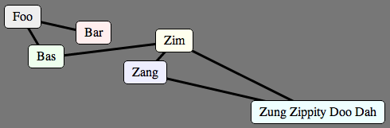

# Unobtrusive Javascript graphs

This is a small blob of jQuery-based Javascript that lets you represent graphs as simple 
HTML markup. It uses CSS transforms to render connections. Graph nodes may be any `block` or
`inline-block` element with an `id`, and connections are created as `<hr>` tags with `id`s of
the form `from-id:to-id`. The formatting of nodes and connections is completely up to the
stylesheet. For example:

```html
<!DOCTYPE html>
<title>Graph Example</title>
<link rel=stylesheet href=graphs.css>
<link rel=stylesheet href=example.css>
<script src=jquery-1.7.2.min.js></script>
<script src=jquery-ui-1.8.18.min.js></script>
<script src=graphs.js></script>
<script src=example.js></script>
<div class=graph-container id=example>
 <div class=graph-node id=foo>Foo</div>
 <div class=graph-node id=bar>Bar</div>
 <div class=graph-node id=bas>Bas</div>
 <div class=graph-node id=zim>Zim</div>
 <div class=graph-node id=zang>Zang</div>
 <div class=graph-node id=zung>Zung Zippity Doo Dah</div>
 <hr class=graph-connection id=foo:bar>
 <hr class=graph-connection id=foo:bas>
 <hr class=graph-connection id=bas:zim>
 <hr class=graph-connection id=zim:zang>
 <hr class=graph-connection id=zang:zung>
 <hr class=graph-connection id=zung:zim>
</div>
```

gets rendered as:



## How to use

Use the included `graphs.css` stylesheet, and load `graphs.js` at some point after loading jQuery.
Inside a `graph-container` div, specify graph nodes (of any tag type) with class `graph-node` and
unique `id`s, and connections as `hr` tags of class `graph-connection` with id `from-id:to-id`.

If your content is static, you're done. For dynamic content, there are a couple of Javascript
functions exposed that will keep graph connections correctly positioned if things move around.
`Graphs.updateConnections(node1, node2, ...)` will update all connections to or from the given
node element(s). `Graphs.newConnection(hr)` will register an hr element as a graph connection.
For example, the following Javascript will register all `graph-node`s as jQuery UI Draggables,
updating their connections as they get dragged:

```javascript
$('.graph-node').draggable({
    drag: function(ev, ui) {
        Graphs.updateConnections(ev.target);
    }});
```
